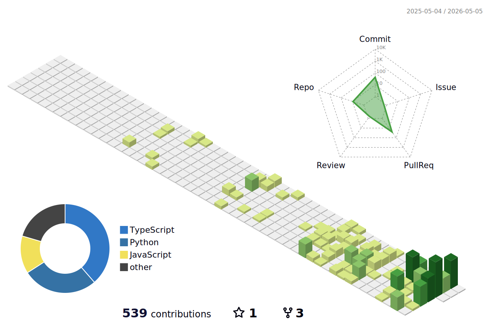

### Computer Science @ CU Boulder

Software Engineering | AI/ML | Data Engineering | Full-Stack Development

<h3 align="center">Tech Stack</h3>

  
  
  
  
  
  
   
  
  
  
  
  
  
   
  
  
  
  
  
  
   
  
  
  
  
  
  

<h3 align="center">Tools</h3>

  
  
  
  
  
  
   
  
  
  
  
  

### Experience

| Organization | Role | Timeline | Focus |
| --- | --- | --- | --- |
| Empower | Software Engineering Intern | May 2025 - Aug 2025 | API dependency graph, React, Neo4j, Node.js, TypeScript, AWS |
| University of Missouri Columbia | AI/Cybersecurity Researcher | May 2024 - Jul 2024 | Federated learning, anomaly detection, TensorFlow, PyTorch |
| [Ribbn](https://joinribbn.org) | Software Engineer | 2024 - Present | Peer-support social app for cancer patients/survivors, smart matching, private messaging, moderation |

### Featured Projects

| Project | Stack | Highlights |
| --- | --- | --- |
| [Real-Time Event Streaming & Analytics Platform](https://github.com/rohanadepu/Real-Time-Event-Streaming-Analytics-Platform) | Kafka, Flink/Spark, Redis, FastAPI | 5,000+ events/sec, p95 latency under 150ms, observability with Prometheus/Grafana |
| [Personal Finance Data Aggregator & Insights Platform](https://github.com/rohanadepu/-Personal-Finance-Data-Aggregator-Insights-Platform) | Airflow, Spark, PostgreSQL, Streamlit | 10M+ records, anomaly detection, forecasting, MLflow tracking |
| [FLVision](https://github.com/rohanadepu/FLVision) | Python, Federated Learning, GANs, NIDS | Hierarchical federated learning and GAN-based intrusion detection for IoT/private networks |

### GitHub Stats

### 3D Contributions

